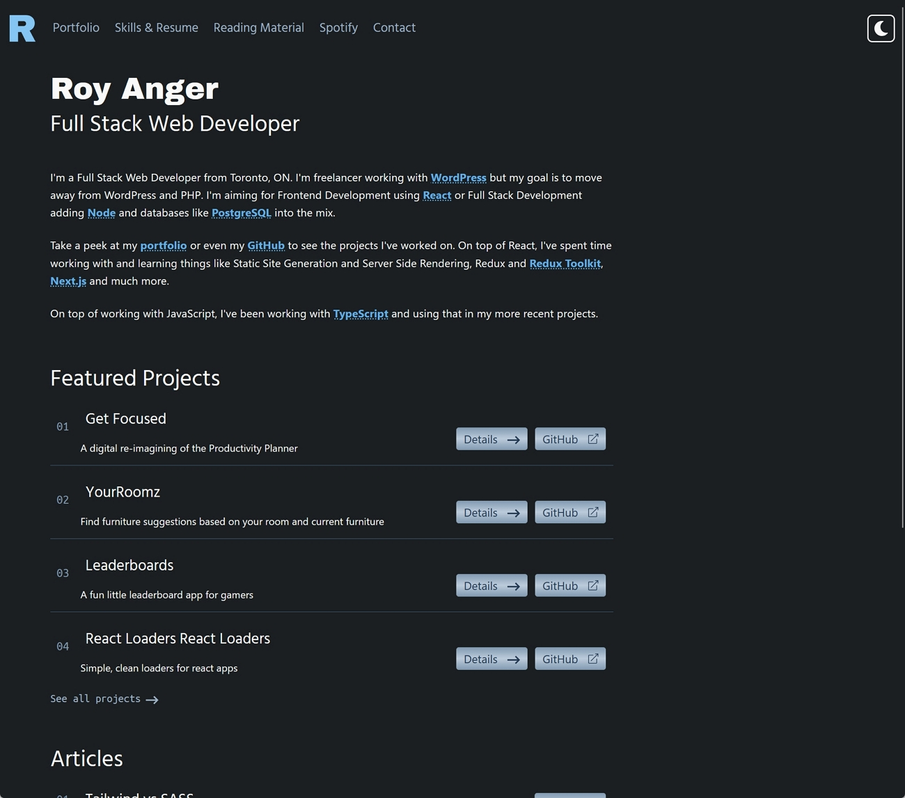

# royanger.com

A new, fully React-based website built to house my portfolio, contact details and blog. The goal was something modern, using the technology stacks I am currently working with and to move away from WordPress.

-  **Library** [React](https://reactjs.org/)
-  **Language** [TypeScript](https://www.typescriptlang.org/)
-  **Framework** [Next.js](https://nextjs.org/)
-  **CSS Framework** [Tailwind CSS](https://tailwindcss.com/)
-  **Content** [Contentlayer](https://www.contentlayer.dev/)
-  **Data Fetching** [SWR](https://github.com/vercel/swr)
-  **Deployment** [Vercel](https://vercel.com)
-  **Monitoring** [Logrocket](https://logrocket.com/)

## Goals

-  Easy to manage blog via markdown
-  Allow for blog posts and 'bookmarks' as reading material
-  Great mobile, tablet and desktop experience
-  Great accessibility
-  Portfolio showcase
-  Light and Dark mode
-  Clean and professional

## Running Locally

```bash
git clone https://github.com/royanger/royanger.com.git
cd royanger.com
npm install
npm run dev
```

Set the following variables as Environment Variables in Vercel, then use the CLI to create a local copy of those in your project.

**ENV Variables**

```js
SPOTIFY_CLIENT_ID=
SPOTIFY_CLIENT_SECRET=
SPOTIFY_REFRESH_TOKEN=

AWS_EMAIL_ACCESS_KEY=
AWS_EMAIL_ACCESS_SECRET=
AWS_EMAIL_REGION=
```

-  _please note that you will need to setup Spotify accordingly_

**Vercel CLI**

```bash
vercel env pull
```

-  requires you have setup Vercel CLI and linked to your project. See [Project Linking](https://vercel.com/docs/cli#introduction/project-linking) for more info

## MDX Components

### Tweet

```jsx
<Tweet id="1516852789518888960" />
```

Provide a tweet ID to create an embedded tweet on the page.

### Alert

You can use the Alert component to create a box that stands out from the rest of the article. You can provide a type of `info`, `alert` or `callout`, each of which creates an appropriately coloured bar on the left edge of the Alert box. You can also pass an emoji to the component to have that displayed inside of the alert box. You can use any combination of the `type` and `emoji` to create the look you're going for.

```jsx
<Alert type="info">Cras sapien dolor, maximus quis orci quis.</Alert>
```

```jsx
<Alert emoji="👋">Cras sapien dolor, maximus quis orci quis.</Alert>
```

```jsx
<Alert emoji="🍕" type="callout">
   Cras sapien dolor, maximus quis orci quis.
</Alert>
```

### Quote

Create a stylized quote. You must provide the quote as a child and the author using the `author` prop.

```jsx
<Quote author="Mark Twain">Cras sapien dolor, maximus quis orci quis.</Quote>
```

## Adding a code block

You add a code block to the markdown/MDX with the standard triple backticks to start and end the block. Additionally you can provide lines or ranges of lines inside of `{}` and those lines will be highlighted accordingly. You can also enter a colon (`:`) and then a file name to have a header attached to the code block with the file name in it.

````js
;```typescript:lib/mdx.ts {5-7, 10-12}
type Tag = {
   item: string
}

const Tag = ({ item }: Tag) => {
   return (
      <span className="text-blue rounded dark:text-blue-300 bg-grey-200 dark:bg-grey-700 py-1 px-2 my-1 mr-2">
         {item}
      </span>
   )
}

export default Tag
```
````
